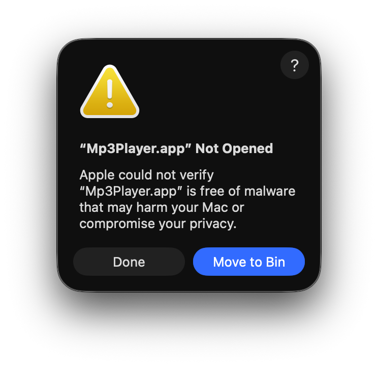

# App is damaged and can't be opened

The conditions Apple imposes to maintain user security and privacy are becoming increasingly strict. This, of course, benefits users but it has drawbacks.

Currently, an Apple Developer account is required to digitally sign or notarize Mac applications. However, many developers don't want to register with the Apple Developer Program, either because of the cost or because they develop small apps that are distributed for free. This is the case with Mp3Player that is signed ad-hoc and not notarized. 

Additionally, when a file is downloaded from the Internet, an extended attribute named `com.apple.quarantine` is added to it so that Gatekeeper requests confirmation before executing them.

Therefore, when you open Mp3Player for the first time you may see a notice:

> App is damaged and can't be opened.<br>
You should move it to the Trash.



Although the source code is available and can be explored to determine if there are any conditions that weaken security by hiding it from the user, this warning may raise some eyebrows. 

## Fixing the issue

Users who have Gatekeeper disabled will not see this warning. However, disabling Gatekeeper globally to run a single application is not a valid recommendation.

How to fix this issue?

### System Settings >> Security and Privacy

First, go to Privacy & Security to see if there's a message about blocking Mp3Player with Open Anyway option. This is the easiest way to fix it.

<kbd>

</kbd>
<br><br>
By clicking Open Anyway, macOS will ask again if you want to open the file, and if you answer yes, it will ask for the user password and open it. 


From this point on, Mp3Player will run without security prompts because macOS has removed the `com.apple.quarantine` attribute.

### `xattr` command line tool

`xattr`handles extended attributes (*xattrs*), which are additional metadata attached to files and directories beyond standard information like name or size. This tool is built into macOS natively. With `xattr` you can remove the com.apple.quarantine attribute from Mp3Player and the task is also quite simple.

- `xattr` displays extended attributes:

```
> sudo xattr /Applications/Mp3Player.app
> com.apple.quarantine
```

- `xattr -cr` removes extended attributes:

`> sudo xattr -cr /Applications/MP3Player.app`

- After this command, xattr no longer displays `com.apple.quarantine` extended attribute:

```
> sudo xattr /Applications/Mp3Player.app 
> (no output)
```

From this point on, Mp3Player will run without security prompts because `xattr` has removed the `com.apple.quarantine` attribute.
