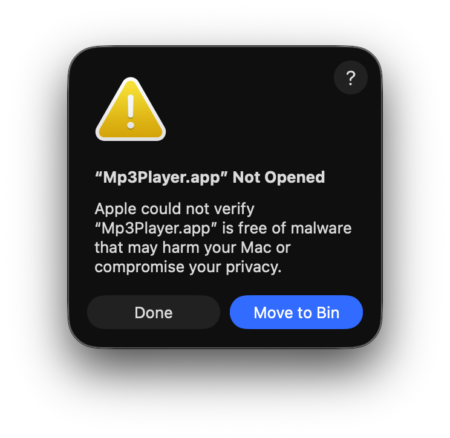
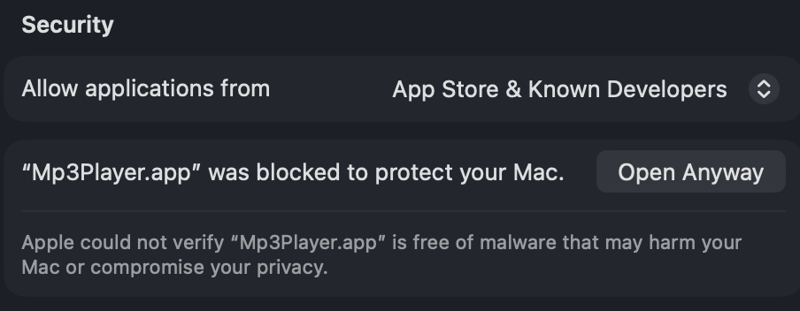
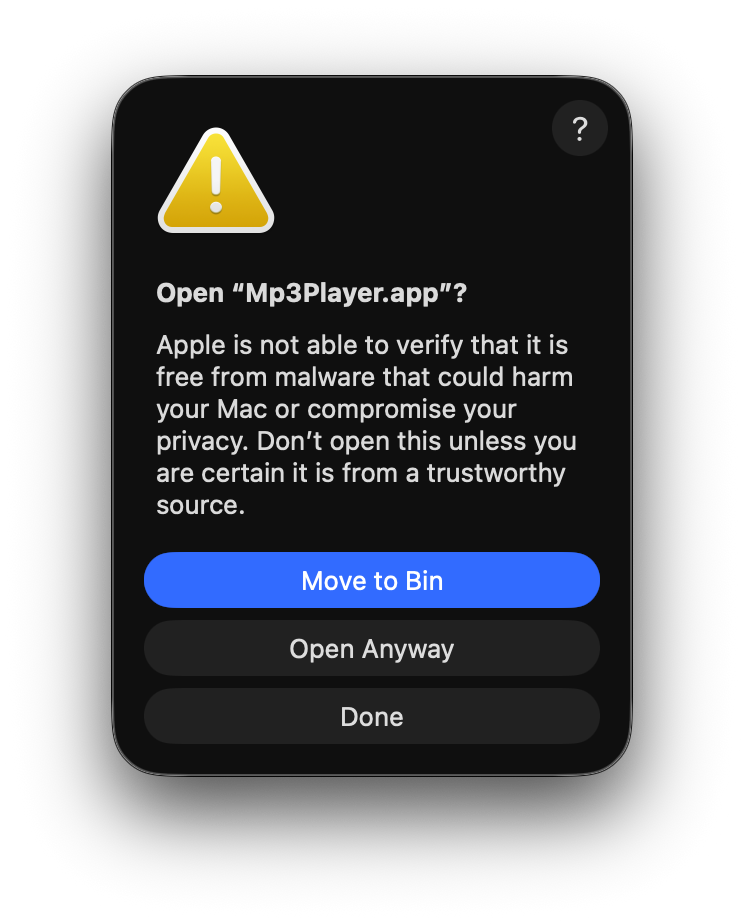

# La aplicación está dañada y no se puede abrir

Las condiciones que Apple impone para mantener la seguridad y privacidad del usuario son cada vez más estrictas. Esto, por supuesto, beneficia a los usuarios, pero tiene inconvenientes.

Actualmente, se requiere una cuenta de Apple Developer para firmar digitalmente o notarizar aplicaciones de Mac. Sin embargo, muchos desarrolladores no quieren registrarse en el Programa de Desarrolladores de Apple, ya sea por el costo o porque desarrollan pequeñas aplicaciones que se distribuyen de forma gratuita. Este es el caso de Mp3Player que está firmado ad-hoc y no notarizado.

Además, cuando se descarga un archivo de Internet, se le agrega un atributo extendido llamado `com.apple.quarantine` para que Gatekeeper solicite confirmación antes de ejecutarlos.

Por lo tanto, cuando abres Mp3Player por primera vez, es posible que veas un aviso:

> La aplicación está dañada y no se puede abrir.<br>
Deberías moverla a la Papelera.



Aunque el código fuente está disponible y se puede explorar para determinar si hay alguna condición que debilite la seguridad al ocultarla del usuario, esta advertencia puede levantar algunas cejas.

## Solución del problema

Los usuarios que tienen Gatekeeper deshabilitado no verán esta advertencia. Sin embargo, deshabilitar Gatekeeper globalmente para ejecutar una sola aplicación no es una recomendación válida.

¿Cómo solucionar este problema?

### Ajustes del Sistema >> Privacidad y Seguridad

Primero, ve a Privacidad y Seguridad para ver si hay un mensaje sobre el bloqueo de Mp3Player con la opción Abrir de todas formas. Esta es la forma más fácil de solucionarlo.

<kbd>

</kbd>
<br><br>
Al hacer clic en Abrir de todas formas, macOS preguntará nuevamente si deseas abrir el archivo, y si respondes que sí, solicitará la contraseña del usuario y lo abrirá.



A partir de este momento, Mp3Player se ejecutará sin solicitudes de seguridad porque macOS ha eliminado el atributo `com.apple.quarantine`.

### Herramienta de línea de comandos `xattr`

`xattr` maneja atributos extendidos (*xattrs*), que son metadatos adicionales adjuntos a archivos y directorios más allá de la información estándar como nombre o tamaño. Esta herramienta está integrada en macOS de forma nativa. Con `xattr` puedes eliminar el atributo com.apple.quarantine de Mp3Player y la tarea también es bastante simple.

- `xattr` muestra los atributos extendidos:

```
> sudo xattr /Applications/Mp3Player.app
> com.apple.quarantine
```

- `xattr -cr` elimina los atributos extendidos:

`> sudo xattr -cr /Applications/MP3Player.app`

- Después de este comando, xattr ya no muestra el atributo extendido `com.apple.quarantine`:

```
> sudo xattr /Applications/Mp3Player.app 
> (sin salida)
```

A partir de este momento, Mp3Player se ejecutará sin solicitudes de seguridad porque `xattr` ha eliminado el atributo `com.apple.quarantine`.
