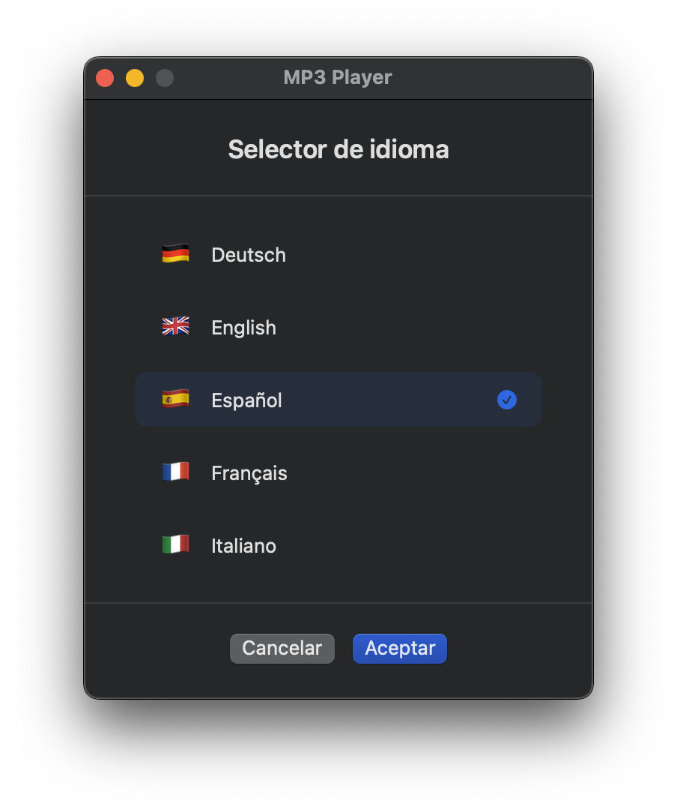

# Mp3Player en SwiftUI

Una aplicación simple de SwiftUI para macOS para reproducir archivos de audio MP3 y M4A.

## Características

- **Idiomas**: Inglés y español
- **Abrir archivos de audio**: Abre archivos de audio MP3 y M4A para reproducir
- **Abrir directorios**: Carga todos los archivos MP3 y M4A de un directorio
- **Menú Play**: Menú dedicado con atajos de teclado para todos los controles de reproducción
- **Controles de reproducción**: Botones Reproducir/Pausar, Detener, Anterior, Siguiente
- **Modo aleatorio**: Reproducción aleatoria de pistas
- **Visualización de tiempo**: Muestra el tiempo transcurrido y el tiempo restante para la pista actual
- **Información de la pista**: Muestra el título de la canción y el artista extraídos de los metadatos del audio
- **Estado persistente**: Guarda y restaura automáticamente la última pista reproducida
- **Abrir con Finder**: Soporte para abrir archivos MP3 y M4A a través del Finder
- **Fondo de carátula de álbum**: Muestra la imagen de la carátula del álbum como fondo difuminado cuando está disponible
- **Icono en la barra de menú**: Muestra un icono de nota musical en la barra de menú de macOS mientras la aplicación está en ejecución
- **Notificaciones de cambio de canción**: Muestra notificaciones de macOS con el título y el artista cada vez que cambia una canción (macOS 15+)
- **Soporte de idiomas**: Soporte para inglés, español, francés, alemán e italiano con ventana para seleccionar idioma.

## Requisitos

- macOS 13.0 o posterior
- Xcode 15.0 o posterior

## Uso

1. Usa el menú Archivo o los atajos de teclado para abrir:
	- Archivo individual: Presiona `Cmd+O` o ve a `Archivo > Abrir archivo de audio...`
	- Directorio: Presiona `Cmd+D` o ve a `Archivo > Abrir directorio...`

2. Usa el menú Play o los atajos de teclado para controlar la reproducción:
	- ⏪️ Pista anterior: `Ctrl+A` o ve a `Play > Anterior`
	- ▶️ Reproducir / ⏸️ Pausar: `Ctrl+P` o ve a `Play > Reproducir/Pausar`
	- ⏹️ Detener reproducción: `Ctrl+S` o ve a `Play > Detener`
	- ⏩️ Pista siguiente: `Ctrl+N` o ve a `Play > Siguiente`
	- 🔀 Activar/desactivar modo aleatorio: `Ctrl+H` o ve a `Play > Aleatorio`

3. También puedes usar los botones de control de reproducción en la ventana de la aplicación.
	
4. Haz clic derecho en un archivo MP3 o M4A para abrirlo a través del Finder.

5. Barra de menús (`Idioma > Elige idioma` o teclado `⌘ + L`) para abrir la ventana del selector de idioma.

## Selector de idioma

## Nota sobre las notificaciones

Las notificaciones de cambio de canción solo están habilitadas en macOS 15 Sequoia y macOS 26 Tahoe. macOS 14 Sonoma y versiones anteriores tienen problemas de compatibilidad con la visualización de notificaciones, por lo que muestran el icono en la barra de menú pero no las notificaciones.

Estoy trabajando en ello. Cualquier ayuda será bienvenida.

## La aplicación está dañada y no se puede abrir

Si ves `La aplicación está dañada y no se puede abrir` cuando abres MP3Player por primera vez, lee [App-damaged-ES.md](DOCS/App-damaged-es.md).

## Mensajes de consola

Puedes ver varios mensajes de consola cuando ejecutas la aplicación en Xcode. La mayoría de estos son mensajes del sistema inofensivos de los frameworks de macOS. Para obtener una explicación detallada de lo que significa cada mensaje y cuáles se pueden ignorar con seguridad, consulta [Console-messages-ES.md](DOCS/Console-messages-ES.md).

## Compilación

Abre `Mp3Player.xcodeproj` en Xcode y compila el proyecto.
