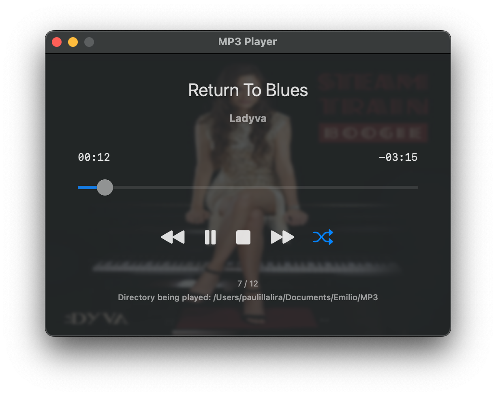

# Mp3Player in SwiftUI

A simple SwiftUI app for macOS to play MP3 files.

## Features

- **Open MP3 Files**: Open a single MP3 file to play
- **Open Directories**: Load all MP3 files from a directory
- **Playback Controls**: Play/Pause, Stop, Previous, Next buttons
- **Shuffle Mode**: Random playback of tracks
- **Time Display**: Shows elapsed time and remaining time for current track
- **Track Information**: Displays song title and artist extracted from MP3 metadata
- **Persistent State**: Automatically saves and restores the last played track
- **Open with Finder**: Support for opening MP3 files via Finder
- **Album Art Background**: Displays album artwork as a blurred background when available
- **Languages**: English and Spanish.

## Requirements

- macOS 13.0 or later
- Xcode 15.0 or later

## Usage

1. Use the File menu or keyboard shortcuts to open:
 	- Single File: Press `Cmd+O` or go to `File > Open MP3 File...`
	- Directory: Press `Cmd+D` or go to `File > Open Directory...`

2. Use the playback controls to:
 	- ▶️ Play / ⏸️ Pause the current track
 	- ⏹️ Stop playback
 	- Skip to previous ⏪️ / next ⏩️ track
 	- 🔀 Toggle shuffle mode.
	
3. Rifht button on a MP3 file to open it via Finder.

## App is damaged and can't be opened

If you see `App is damaged and can't be opened` when you open MP3Player for the first time, read [this](App-damaged.md).

## Building

Open `Mp3Player.xcodeproj` in Xcode and build the project.

## License

This project is licensed under the MIT License - see the [LICENSE](LICENSE) file for details.
