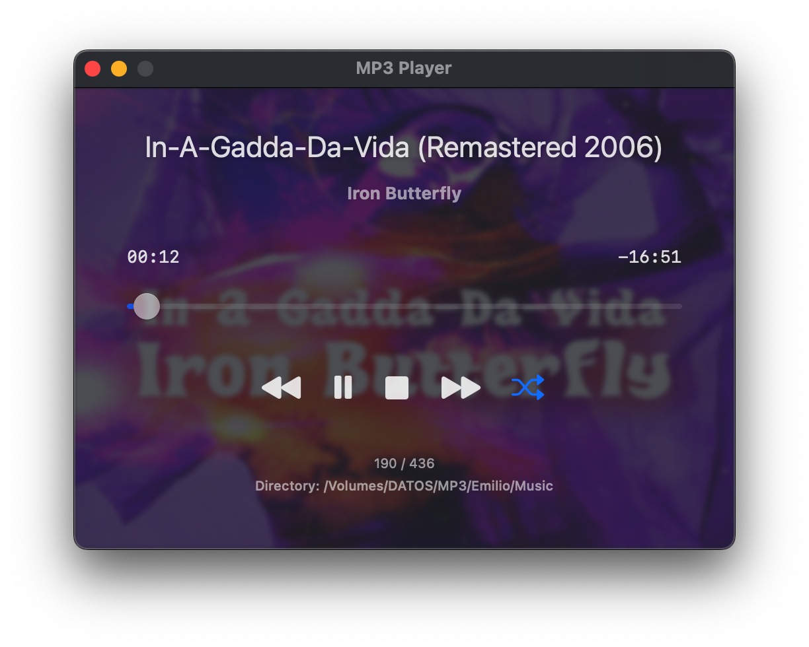

# Mp3Player in SwiftUI

  

A simple SwiftUI app for macOS to play MP3 and M4A audio files.

## Features

- **Languages**: English and Spanish
- **Open Audio Files**: Open MP3 and M4A audio files to play
- **Open Directories**: Load all MP3 and M4A files from a directory
- **Play Menu**: Dedicated menu with keyboard shortcuts for all playback controls
- **Playback Controls**: Play/Pause, Stop, Previous, Next buttons
- **Shuffle Mode**: Random playback of tracks
- **Time Display**: Shows elapsed time and remaining time for current track
- **Track Information**: Displays song title and artist extracted from audio metadata
- **Persistent State**: Automatically saves and restores the last played track
- **Open with Finder**: Support for opening MP3 and M4A files via Finder
- **Album Art Background**: Displays album artwork as a blurred background when available
- **Menu Bar Icon**: Shows a music note icon in the macOS menu bar while the app is running
- **Song Change Notifications**: Displays macOS notifications showing title and artist each time a song changes (macOS 15+)
- **Language support**: Support for English, Spanish, French, German and Italian with language selector window.

## Requirements

- macOS 13.0 or later
- Xcode 15.0 or later

## Usage

1. Use the File menu or keyboard shortcuts to open:
 	- Single File: Press `Cmd+O` or go to `File > Open Audio File...`
	- Directory: Press `Cmd+D` or go to `File > Open Directory...`

2. Use the Play menu or keyboard shortcuts for playback control:
 	- ⏪️ Previous track: `Ctrl+A` or go to `Play > Previous`
 	- ▶️ Play / ⏸️ Pause: `Ctrl+P` or go to `Play > Play/Pause`
 	- ⏹️ Stop playback: `Ctrl+S` or go to `Play > Stop`
 	- ⏩️ Next track: `Ctrl+N` or go to `Play > Next`
 	- 🔀 Toggle shuffle mode: `Ctrl+H` or go to `Play > Shuffle`

3. You can also use the playback control buttons in the app window.
	
4. Right-click on an MP3 or M4A file to open it via Finder

5. Menubar (`Language > Select language` or keyboard `⌘ + L`) to open the language selector window.

## Language selector

## Note about notifications

Song change notifications are only enabled on macOS 15 Sequoia and macOS 26 Tahoe. macOS 14 Sonoma and earlier have compatibility issues with the notification display, so they show the icon in the menu bar but not the notifications. 

I'm working on it. Any help would be appreciated.

## App is damaged and can't be opened

If you see `App is damaged and can't be opened` when you open MP3Player for the first time, read [App-damaged.md](DOCS/App-damaged.md).

## Console Messages

You may see various console messages when running the app in Xcode. Most of these are harmless system messages from macOS frameworks. For a detailed explanation of what each message means and which ones are safe to ignore, see [Console-messages.md](DOCS/Console-messages.md).

## Building

Open `Mp3Player.xcodeproj` in Xcode and build the project.
